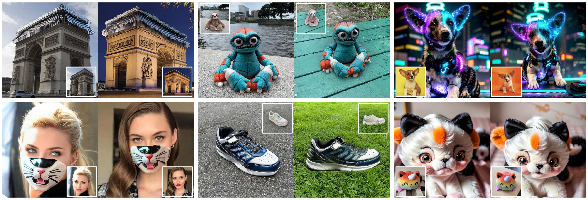
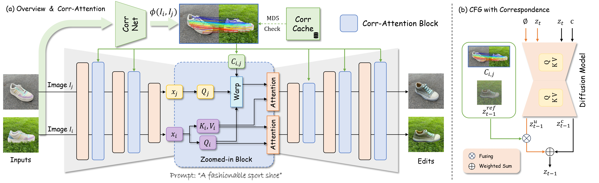

# Edicho: Consistent Image Editing in the Wild

> **Edicho: Consistent Image Editing in the Wild** <br>
> Qingyan Bai, Hao Ouyang, Yinghao Xu, Qiuyu Wang, Ceyuan Yang, Ka Leong Cheng, Yujun Shen, Qifeng Chen <br>

<div align=center>

</div>

**Figure:**  Given two images in the wild, Edicho generates consistent editing versions of them in a zero-shot manner. Our approach
achieves precise consistency for editing parts (left), objects (middle), and the entire images (right) by leveraging explicit correspondence.

**[**[**Paper**](https://arxiv.org/abs/2412.21079)**]**
**[**[**Project Page**](ant-research.github.io/edicho/)**]**

As a verified need, consistent editing across in-the-wild images remains a technical challenge arising from various unmanageable factors, like object poses, lighting conditions, and photography environments.
<i>Edicho</i>, embodying "echoing the editing effect", steps in with a training-free solution based on diffusion models, featuring a fundamental design principle of using <b>explicit</b> image correspondence to direct editing.
Specifically, the key components include an attention manipulation module and a carefully refined classifier-free guidance (CFG) denoising strategy, both of which take into account the pre-estimated correspondence.
Such an inference-time algorithm enjoys a plug-and-play nature and is compatible to most diffusion-based editing methods, such as ControlNet and BrushNet.
Extensive results demonstrate the efficacy of <i>Edicho</i> in consistent cross-image editing under diverse settings.

<div align=center>

</div>

**Figure:**  Method overview. To achieve consistent editing, we propose a training-free and plug-and-play method that injects the pre-computed correspondence into the pre-trained diffusion models and guides the denoising in the two levels of (a) attention features and (b) noisy latents in classifier-free guidance (CFG).


## BibTeX

If you find our work helpful for your research, please consider to cite:
```bibtex
@inproceedings{bai2024edicho,
  title     = {Edicho: Consistent Image Editing in the Wild},
  author    = {Bai, Qingyan and Ouyang, Hao and Xu, Yinghao and Wang, Qiuyu and Yang, Ceyuan and Cheng, Ka Leong and Shen, Yujun and Chen, Qifeng},
  booktitle = {arXiv preprint arXiv:2412.21079},
  year      = {2024}
}
```
